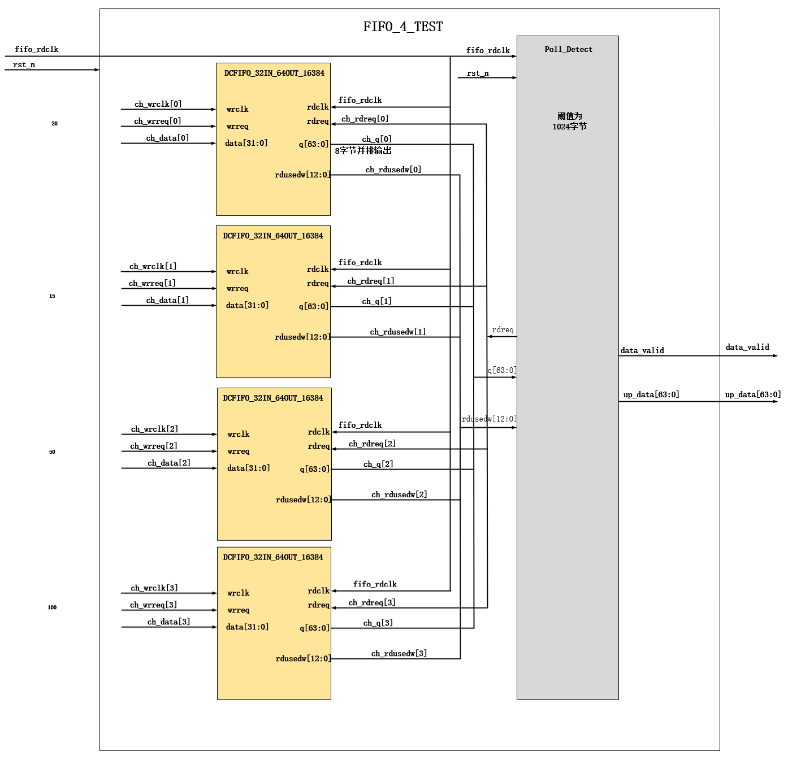
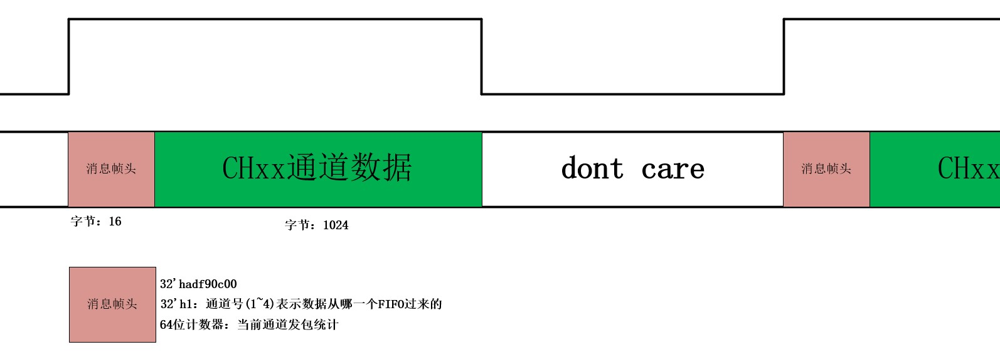

## FIFO_v4

如果1个大模块中有多个小模块，且小模块之间有相互连线，这些连线没有从大模块出去或者进来，则需要声明小模块之间的连接线。

本次为FIFO核（Git）的版本练习

总共发布8个版本，依次如下:

4FIFO-不带帧头-不用generate

4FIFO-不带帧头-用generate

4FIFO-带帧头-不用generate

4FIFO-带帧头-用generate

30FIFO-不带帧头-不用generate

30FIFO-不带帧头-用generate

30FIFO-带帧头-不用generate

30FIFO-带帧头-用generate

### 版图设计：

### 数据帧:

通过控制非IDLE和读使能信号来增加数据帧头（输入解决方案）；
避免两个变量相互作为判断条件情况的出现

